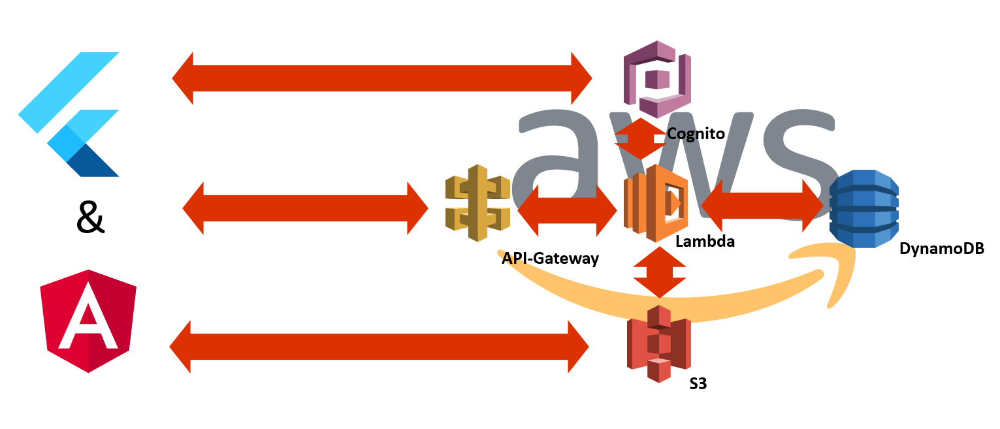
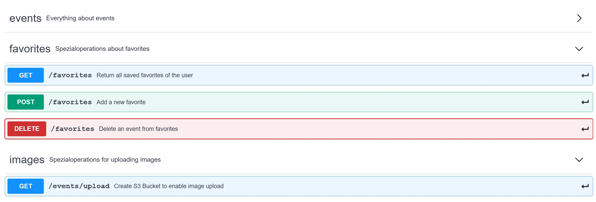

# Dokumentation

## Architektur
Im Projekt wurde sich dazu entschieden zwei Front-Ends anzubieten, die beide auf das gleiche Back-End zugreifen.

Während das eine Front-End auf Flutter basiert, basiert das andere Front-End auf Angular.

Das Back-End setzt sich aus einer Kombination an AWS-Services zusammen, die den Front-Ends alle nötigen Funktionen bereitstellen. Die genutzten Services sind dabei:
* Cognito
* S3
* DynamoDB
* Lambda
* API-Gateway

Während Cognito für die User-Authentifizierung und Registrierung zuständig ist, wird S3 genutzt, um zum einen den Front-Ends das Hochladen von Bildern zu ermöglichen und zum anderen zum Hosten der Angular Web-Applikation ([app.actevents.de](https://app.actevents.de)).

Über das API-Gateway wird den Front-Ends eine REST-API bereitgestellt (vgl. [Kommunikation zwischen Back-End und den Front-Ends](#chapter-api)), die für die Hauptfunktionen der Applikation zuständig ist. Durch diese REST-API werden wiederum Lambdas aufgerufen, die dann zum Beispiel auf die persistent gespeicherten Events in der DynamoDB zugreifen oder welche in dieser anlegen.

Zur Benutzerauthentifizierung wird Amazon Cognito verwendet. Dabei wird ein Benutzerpool mit zwei App-Clients erstellt, welcher die Authentifizierung an dem jeweiligen Client ermöglicht. Bei der Erstellung des Benutzerpools können verschiedene Attribute für einen Benutzer ausgewählt oder hinzugefügt werden. Für die Authentifizierung in Actevents wird nur eine E-Mail Adresse benötigt. Cognito ermöglicht auch die Authentifizierung über externe Identitätsanbieter wie bspw. Google oder Facebook. 

##  Kommunikation zwischen Back-End und den Front-Ends 
Die Kommunikation zwischen dem Back-End und den Front-Ends funktioniert über eine REST-API, die folgende Endpunkte bereitstellt.

Eine genaue Definition dieser als OpenAPI findet sich in der [apidoc.yml](apidoc.yml).

## Angular
[Angular Dokumentation](angular.md)

## Flutter
[Flutter Dokumentation](flutter.md)

## Persistenz
Damit Events gespeichert bleiben, wird Amazon DynamoDB verwendet. DynamoDB ist eine NoSQL-Datenbank. Die Events haben folgende Attribute in der Datenbank.

* id: Die UUID des Events
* dates: Die Anfangs- und Endzeit des Events 
  * begin
  * end
* description: Die Beschreibung des Events
* image: Die UUID des zugehörigen Bildes im S3-Bucket
* location: Der Ort des Events in geographischen Koordinaten
  * latitude
  * longitude
* name: Der Name des Events
* organizer: Der Ersteller bzw. Organisator des Events
* price: Der Preis des Events
* tags: Die Tags des Events

Das Persistieren der Bilder folgt über einen Amazon S3-Bucket. Hier können die einzelnen Bilder abgelegt werden. Der Name eines solchen Bildes ist hierbei eine UUID. Diese ist in der Datenbank bei dem zugehörigen Event abgelegt. Das Hochladen der Bilder folgt über einen generierten Link. Dieser enthält Parameter wie den S3-Bucket, den Name der Datei und den zulässigen Inhalt der hochgeladen werden darf.