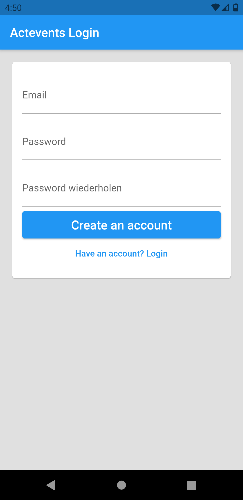
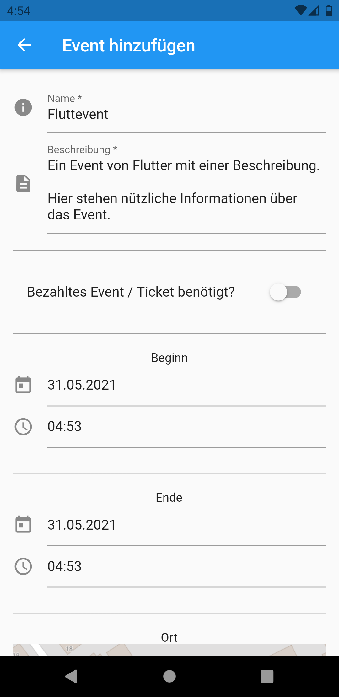
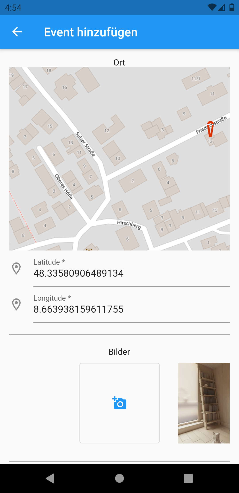
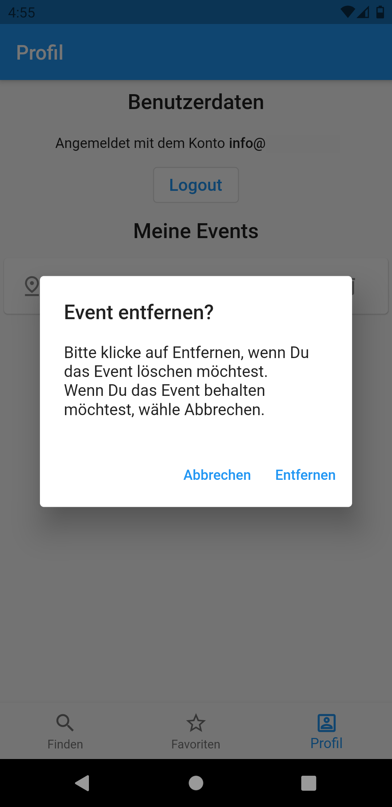

# Dokumentation

## Architektur
Im Projekt wurde sich dazu entschieden zwei Front-Ends anzubieten, die beide auf das gleiche Back-End zugreifen.


Während das eine Front-End auf Flutter basiert, basiert das andere Front-End auf Angular.

Das Back-End setzt sich aus einer Kombination an AWS-Services zusammen, die den Front-Ends alle nötigen Funktionen bereitstellen. Die genutzten Services sind dabei:
* Cognito
* S3
* DynamoDB
* Lambda
* API-Gateway

Während Cognito für die User-Authentifizierung und Registrierung zuständig ist, wird S3 genutzt, um zum einen den Front-Ends das Hochladen von Bildern zu ermöglichen und zum anderen zum Hosten der Angular Web-Applikation ([app.actevents.de](https://app.actevents.de)).

Über das API-Gateway wird den Front-Ends eine REST-API bereitgestellt (vgl. [Kommunikation zwischen Back-End und den Front-Ends](#chapter-api)), die für die Hauptfunktionen der Applikation zuständig ist. Durch diese REST-API werden wiederum Lambdas aufgerufen, die dann zum Beispiel auf die persistent gespeicherten Events in der DynamoDB zugreifen oder welche in dieser anlegen.

## <a name="chapter-api"></a> Kommunikation zwischen Back-End und den Front-Ends 
Die Kommunikation zwischen dem Back-End und den Front-Ends funktioniert über eine REST-API, die folgende Endpunkte bereitstellt.

## Angular
Die Angular Anwendung wurde in 3 Bereiche/Module unterteilt:

1. Discover
1. Saved
1. Settings

#### Discover
Innerhalb der Discover Page werden alle Events in einem ausgewählten Umkreis angezeigt.
Hierbei steht ein Slider zur Verfügung, welcher bei Änderungen seinen neuen Wert im LocalStorage des Browsers persistiert und die Events und Kartenansicht basierend auf dem neuen Suchradius aktualisiert.

Abgerufen werden die Events über den von Angular bereitgestellten ```HttpClient``` von der API Schnittstelle ```/events```.

In einer Karte, welche auf dem Framework ```OpenLayers``` basiert werden die Events in der Nähe über Marker dargestellt.

Wenn ein Event angeklickt wird öffnet sich die Detailansicht, worüber alle Informationen eingesehen werden können.
Außerdem lässt sich über die Detailansicht ein Event als Favorit markieren.

#### Saved
Auf der Saved Page werden einem Benutzer alle von ihm als Favorit markierten Events angezeigt


### Credential Management

## Flutter
Die Flutter Anwendung ist in zwei Stufen aufgeteilt.
1. Nicht angemeldet
    
    Wenn der Benutzer nicht angemeldet ist hat er die Möglichkeit sich anzumelden oder zu registrieren. Bei erfolgreichem Anmelden wird er auf die Angemeldet Stufe weitergeleitet.

    __Logisseite:__    
    
    __Registierungsseite:__
    

1. Angemeldet
    
    Sobald der Benutzer angemeldet ist, landet dieser auf der ``Findenseite``. Die Anmeldung ist auch über die App laufzeit hinweg gespeichert.

### Event Pages

1. _Findenseite_
    1. Auf der Findenseite werden alle aktuellen Events angezeigt die sich in einem gewissen Umkreis(default 50km) vom Standort des Gerätes. Der Umkreis kann über die Filteroptionen angepasst werden.
    
    1. Für eine __Detailansicht des jeweiligen Events__ kann auf das Event getippt werden. Auf der Detailsseite sind dann nochmal zusätzliche Informationen wie die Beschreibung und der Zeitraum des Events ersichtlich.
    
    1. Für das __Speichern in die Favoriten__ muss auf den Stern getippt werden.
    1. Für das __Anlegen eines neuen Events__ kann der Plusbutton benutzt werden. Danach wird der Nutzer auf eine neue Anlegenseite weitergeleitet.
    
    
    Nach Eingabe der Daten werden diese validiert und an den Server geschickt.
1. _Favoritenseite_
    Hier werden alle Events angezeigt die der Benutzer individuell gespeichert hat.
    
1. _Profilseite_
    Auf der Profilseite kann sich der Benutzer abmelden und kann die eigenen Events gelöschen.
    
    

### Credential Management
