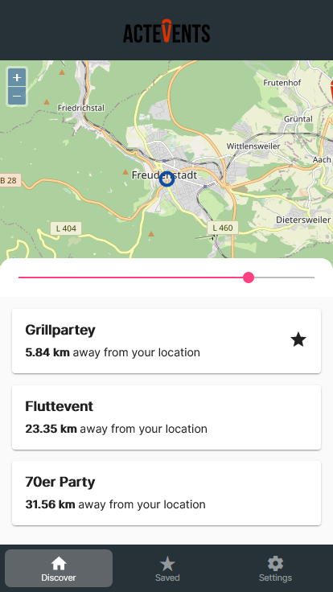
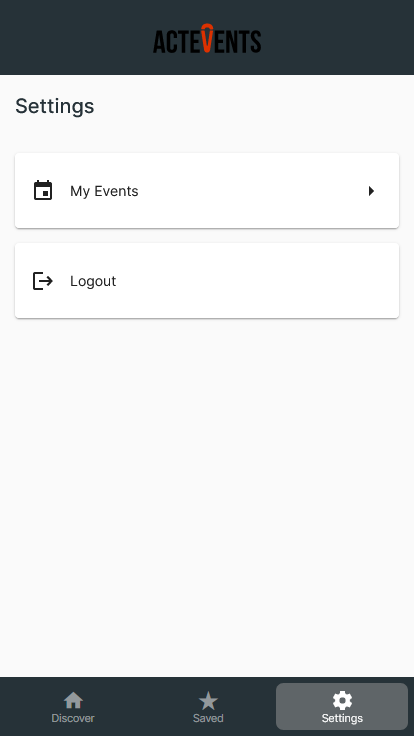
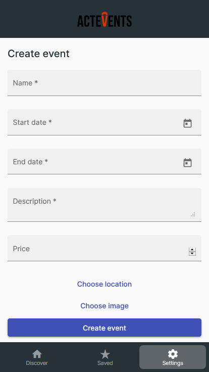

# Angular

## Kommunikation
Um die Kommunikation zwischen der Angular-Applikation und des API Gateways / Cognito / S3 zu vereinfachen wurden Services erstellt.
Diese kapseln die Logik, welche für die Kommunikation zu den Backend-Services benötigt wird und stellen den Komponenten eine einfache Schnittstelle bereit.

Hierfür wurde der vom Angular Framework bereitgestellte ```HttpClient``` über Dependency Injection verwendet.

Insgesamt wurden 3 Services implementiert:

1. __AuthService__, verantwortlich für die Kommunikation mit Cognito und das Credential-/Session-Management.
1. __LocationService__, verantwortlich für das Abrufen der Position des Gerätes über die ```navigator``` Schnittstelle des Browsers.
1. __EventsService__, verantwortlich für die Kommunikation mit dem API Gateway rund um das Abrufen und Anlegen von Events.
1. __FavoritesService__, verantwortlich für die Kommunikation mit dem API Gateway hinsichtlich der Favoriten.

## Module
Die Angular Anwendung wurde in 3 Bereiche/Module unterteilt:

1. Discover
1. Saved
1. Settings

### Discover
Innerhalb der Discover Page werden alle Events in einem ausgewählten Umkreis angezeigt.
Hierbei steht ein Slider zur Verfügung, welcher bei Änderungen seinen neuen Wert im LocalStorage des Browsers persistiert und die Events und Kartenansicht basierend auf dem neuen Suchradius aktualisiert.

Abgerufen werden die Events über einen bereits angesprochenen ```EventsService```, welche die Events von der API Schnittstelle ```/events``` abruft.
Hierfür wird zuerst die aktuelle Position des Benutzers über den ```LocationService``` abgerufen.

In einer Karte, welche auf dem Framework ```OpenLayers``` basiert werden die Events in der Nähe über Marker dargestellt.

Wenn ein Event angeklickt wird öffnet sich die Detailansicht, worüber alle Informationen eingesehen werden können.
Außerdem lässt sich über die Detailansicht ein Event als Favorit markieren.



### Saved
Auf der Saved Page werden einem Benutzer alle von ihm als Favorit markierten Events in einer Liste angezeigt.

Dieser werden von der API unter dem Endpunkt ```/favorites``` abgerufen.

Über einen klick auf ein gespeichertes Event wird ebenfalls die Detailseite aufgerufen.


### Settings
Auf dieser Seite lassen sich die vom aktuell angemeldeten Nutzer erstellten Events managen.
Ebenfalls kann dieser sich über eine Schaltfläche von der Applikation abmelden und landet danach auf der Login/Register Page.



Auf der Unterseite der eigenen Events lassen sich über eine Schaltfläche neue Events erstellen.
Hierzu wird ein Formular geöffnet, welches mithilfe der Forms Funktionalität von Angular erstellt wurde und Validierung und Anzeige von Fehleingaben automatisch handhabt.

Um ein Event zu erstellen oder wieder zu löschen wird wieder der bereits angesprochene ```EventsService``` verwendet.



Hierbei kann zu einem Event auch ein Bild hochgeladen werden, welches auf mobilen Geräten entweder aus der Bildergalerie ausgewählt werden kann oder allerdings durch die Nutzung der Kamera direkt aufgenommen werden kann.

Hierbei wird das Browserverhalten auf einem Mobilgerät genutzt, indem ein normales HTML Input Feld des Types _file_ verwendet wird.
```html
<input type="file" accept="image/*" />
```


## Credential Management

Für die Kommunikation und das Credential-/Session-Management wurde die Amplify-Bibliothek von AWS verwendet.
Diese kapselt die direkte Kommunikation mit verschiedensten AWS Diensten und stellt eine schöne Schnittstelle bereit.

Innerhalb der Angular Applikation wurde nur der _Auth_ Teil von Amplify verwendet.

Über Methoden wie ```Auth.signIn(...)```, ```Auth.signUp(...)``` oder ```Auth.signOut()``` kann der Benutzer so angemeldet, registriert oder abgemeldet werden.
Cognito handhabt dabei das komplette Credentialmanagement wie das Speichern (LocalStorage) und Erneuern von ID-/Access-/Refresh-Tokens zur Authentifizierung über Cognito, ohne dass ein manuelles Eingreifen nötig wäre.
