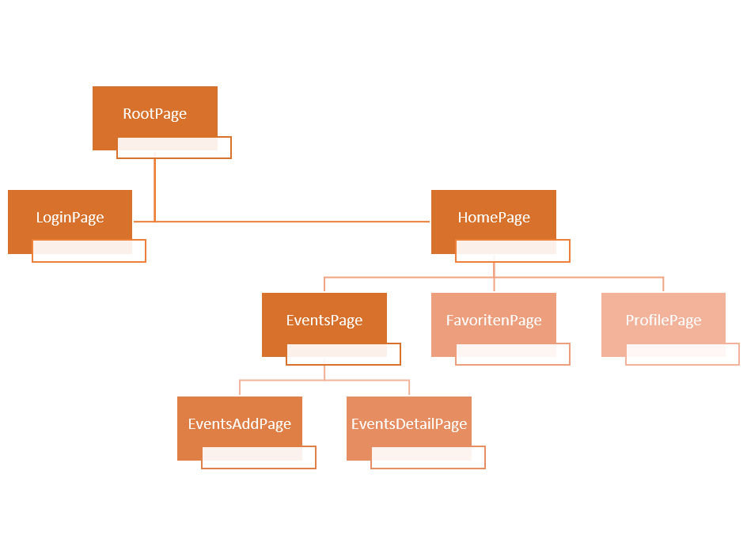

# Flutter
Die Flutter Anwendung ist in zwei Stufen aufgeteilt.
1. Nicht angemeldet
    
    Wenn der Benutzer nicht angemeldet ist hat er die Möglichkeit sich anzumelden oder zu registrieren. Bei erfolgreichem Anmelden wird er auf die Angemeldet Stufe weitergeleitet.

    __Logisseite:__    
    
    __Registierungsseite:__
    

1. Angemeldet
    
    Sobald der Benutzer angemeldet ist, landet dieser auf der ``Findenseite``. Die Anmeldung ist auch über die App laufzeit hinweg gespeichert.

## Event Pages

### _Findenseite_

1. Auf der Findenseite werden alle aktuellen Events angezeigt die sich in einem gewissen Umkreis(default 50km) vom Standort des Gerätes. Der Umkreis kann über die Filteroptionen angepasst werden.

1. Für eine __Detailansicht des jeweiligen Events__ kann auf das Event getippt werden. Auf der Detailsseite sind dann nochmal zusätzliche Informationen wie die Beschreibung und der Zeitraum des Events ersichtlich.

1. Für das __Speichern in die Favoriten__ muss auf den Stern getippt werden.
1. Für das __Anlegen eines neuen Events__ kann der Plusbutton benutzt werden. Danach wird der Nutzer auf eine neue Anlegenseite weitergeleitet.

Nach Eingabe der Daten werden diese validiert und an den Server geschickt.
### _Favoritenseite_
Hier werden alle Events angezeigt die der Benutzer individuell gespeichert hat.

### _Profilseite_
Auf der Profilseite kann sich der Benutzer abmelden und kann die eigenen Events gelöschen.

## Credential Management

Die Logindaten werden über Amplify gespeichert und für die Appservices bereitgestellt.

## Verwendete Abhängigkeiten

- amplify_flutter: Framework für die Kommunikation mit AWS Services
- amplify_auth_cognito: Framework für die Kommunikation mit AWS Cognito
- geolocator: Bibliothek für die Geolokation
- flutter_map: Bibliothek für Karten UI Elemente
- camera: Bibliothek für die Kamera UI Elemente

## Services

- AuthService: Verwaltet die An- und Abmeldung der Session
- LocationService: Verwaltet Position und GPS-Sensor
- ApiService: Fasst API-Zugriffe in einem Service zusammen
